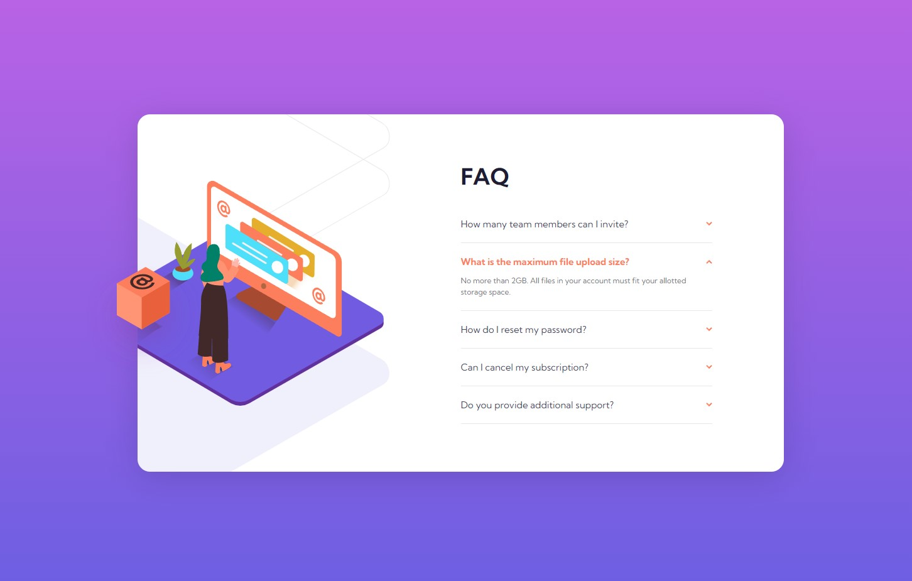

# Frontend Mentor - FAQ accordion card solution

This is a solution to the [FAQ accordion card challenge on Frontend Mentor](https://www.frontendmentor.io/challenges/faq-accordion-card-XlyjD0Oam).

## Table of contents

- [Overview](#overview)
  - [The challenge](#the-challenge)
  - [Screenshot](#screenshot)
  - [Links](#links)
- [My process](#my-process)
  - [Built with](#built-with)
  - [What I learned](#what-i-learned)
  - [Continued development](#continued-development)
- [Author](#author)

## Overview

### The challenge

Users should be able to:

- View the optimal layout for the component depending on their device's screen size
- See hover states for all interactive elements on the page
- Hide/Show the answer to a question when the question is clicked

### Screenshot

### Links

- Solution URL: [Add solution URL here](https://github.com/m00nta/faq-accordion-card-main)
- Live Site URL: [Add live site URL here](https://m00nta.github.io/faq-accordion-card-main/)

## My process

### Built with

- Semantic HTML5 markup
- CSS custom properties
- Flexbox
- CSS Grid
- JavaScript

### What I learned

For me this was a great introduction to JavaScript and how to select elements and loop over it and do something. Also I used a different approach on the CSS Grid and Flexbox so I am experimenting with this project

### Continued development

I wanna keep experimentig with CSS to see what best suits for styling and I want to practice more my JavaScript skills.

## Author

## Author

- Frontend Mentor - [@m00nta](https://www.frontendmentor.io/profile/m00nta)
- Twitter - [@m00nta](https://twitter.com/m00nta)
